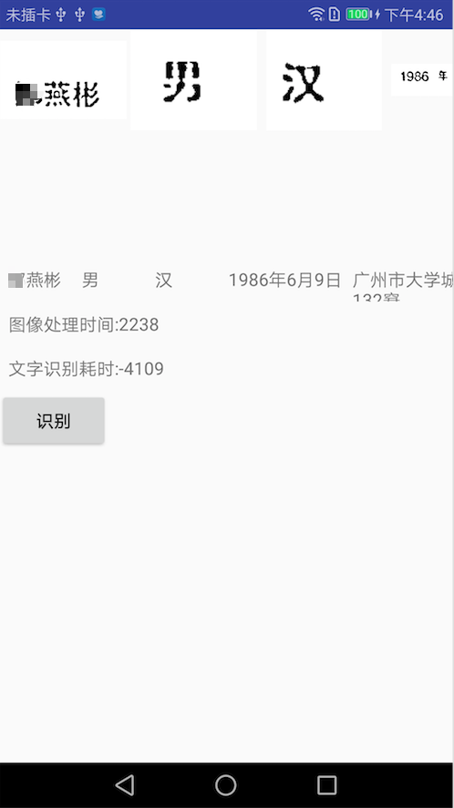
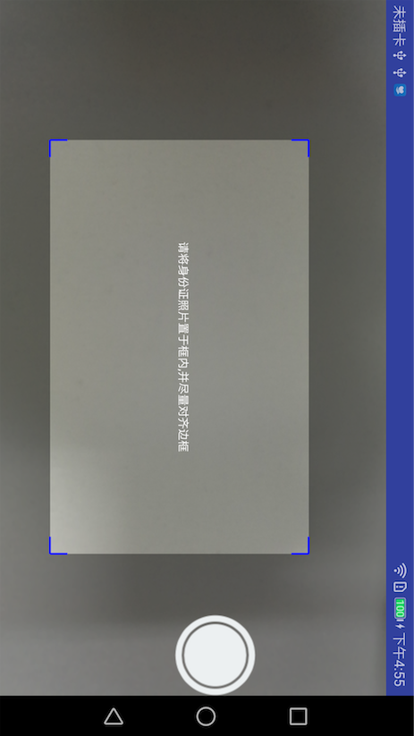

博客地址：[https://blog.csdn.net/Weiye__Lee/article/details/80952724](https://blog.csdn.net/Weiye__Lee/article/details/80952724)

# 写在前面
　　最近因为业务需要，要在Android端实现个扫描身份证识别其中文字的功能，网上溜达了一圈。</br>
　　Android比较推荐的是: </br>
　　GitHub：https://github.com/rmtheis/tess-two</br>
　  当然也有第三方提供的解决方案,比如百度提供的文字识别：http://ai.baidu.com/tech/ocr。
　　咱做技术的还是先折腾折腾,特此记录下过程,也希望能帮助到同样折腾的人,欢迎Star，欢迎Fork~
# 效果图(名字打了马赛克)
  

# 过程
先理下要实现这样的效果，我们需要做些什么

  1. 在Android端需要自定义个含取景框的自定义相机
  2. 对拍摄的图片进行灰度化、二值化处理
  3. 引入tess-two 库,调用相应api将步骤2处理后的图片传入处理

### 1、自定义相机

　　这一步主要是写个布局，使用Camera和SurfaceView做个自定义相机，具体实现可看demo代码,里面有个取景框是专门用来截取出我们关心的区域的

### 2、图片处理
　　机器视觉分为三个阶段 : 图像转化、图像分析、图像理解。若要将一幅图像转化为方便分析理解的格式，有一个很关键的过程就是“图像二值化”。一幅图像能否分析理解的准确很大程度上来说取决于二值化(非黑即白)效果的好坏。而在二值化之前，有一个重要步骤，那便是“图像灰度化”
	
　　所以，先将图片灰度化，这里有个公式：f(x) = R*0.3+G*0.51+B*0.11，实际需要做的就是将图片的每个像素(这里假定android里用ARGB表示一个像素点)的red、green、blue取出并代入此公式算出每个点的灰度值，这样便实现了灰度化</br>
　　   </br>
　　再来看看二值化，二值化的原理就是取一个阈值，然后将每个像素点的灰度值和这个阈值进行比较，如果大于阈值则定为白色，反之为黑色(这里假定要识别的图像是白底黑字)，如此一来便实现了二值化。可以看到，最重要的是这个阈值，该怎么取值才合理，最简单的阈值取定便是取整幅图画的均值了：</br>
　　
　　   </br>
　　效果看上去还不错，实际上用到身份证识别或文字识别上，受阴影等因素的影响，效果就差很多了，因此，优化算法还是很有必要的，网上流传着多种二值化算阈值的算法，这里目前尝试了以下几种：
　　　
1. 阈值迭代算法(效果不理想，字体的笔画容易站在一起，阴影影响大)
　　https://www.cnblogs.com/gxclmx/p/6916515.html
　　
2. 基于Otsu阈值二值化(跟上面的迭代算法效果差不多，阴影影响大)
　　https://blog.csdn.net/mao0514/article/details/47041597
　　
3. 矩阵二值化算法
　　https://blog.csdn.net/lj501886285/article/details/52425157
　　这个算法的阈值是自适应的，对于每个像素点都构造了一个小矩阵来衡量阈值的取值，也就是说每个点都跟它周围的细节相关，这样比起用单一的整体阈值去衡量每个点，显然更具说服力。而事实证明，这个算法应用后的二值化测试效果确实杠杠的
　　
### 3、tess-two api识别
　　这一步就比较简单了，直接上步骤：
1. 引入依赖
```
dependencies {
    implementation 'com.rmtheis:tess-two:9.0.0'
}
```
2. 调用api识别
```
TessBaseAPI tessBaseAPI = new TessBaseAPI();
tessBaseAPI.init(DATAPATH, "chi_sim");//传入训练文件目录和训练文件
tessBaseAPI.setImage(bitmap);
String text = tessBaseAPI.getUTF8Text();	
```
　　就这样短短4行代码便可识别出文字了，这里有个坑要注意，看下tessBaseAPI.init这个方法源码:
```
public boolean init(String datapath, String language) {
        return init(datapath, language, OEM_DEFAULT);
    }
```
可以看到又调用了另一个init方法
```
 public boolean init(String datapath, String language, @OcrEngineMode int ocrEngineMode) {
        if (datapath == null)
            throw new IllegalArgumentException("Data path must not be null!");
        if (!datapath.endsWith(File.separator))
            datapath += File.separator;

        File datapathFile = new File(datapath);
        if (!datapathFile.exists())
            throw new IllegalArgumentException("Data path does not exist!");

        File tessdata = new File(datapath + "tessdata");
        if (!tessdata.exists() || !tessdata.isDirectory())
            throw new IllegalArgumentException("Data path must contain subfolder tessdata!");

        //noinspection deprecation
        if (ocrEngineMode != OEM_CUBE_ONLY) {
            for (String languageCode : language.split("\\+")) {
                if (!languageCode.startsWith("~")) {
                    File datafile = new File(tessdata + File.separator + 
                            languageCode + ".traineddata");
                    if (!datafile.exists())
                        throw new IllegalArgumentException("Data file not found at " + datafile);

                    // Catch some common problematic initialization cases.
                    if (languageCode.equals("ara") || (languageCode.equals("hin") &&
                            ocrEngineMode == OEM_DEFAULT)) {
                        boolean sampleCubeFileExists = new File(tessdata +
                                File.separator + languageCode + ".cube.params").exists();
                        if (!sampleCubeFileExists) {
                            throw new IllegalArgumentException("Cube data files not found." +
                                    " See https://github.com/rmtheis/tess-two/issues/239");
                        }
                    }
                }
            }
        }

        boolean success = nativeInitOem(mNativeData, datapath, language, ocrEngineMode);

        if (success) {
            mRecycled = false;
        }

        return success;
    }
```
这里注意下面这一段代码，api要求DATAPATH目录下，必须有tessdata这样一个子目录，也就是说，训练文件必须放在这个子目录下
```
File tessdata = new File(datapath + "tessdata");
        if (!tessdata.exists() || !tessdata.isDirectory())
            throw new IllegalArgumentException("Data path must contain subfolder tessdata!");
```
　　一个文字识别的demo就此完成了，稍后会传上demo到github，demo做的是身份证，所以对图片的截取处理是针对身份证的，当然也可应用到其他营业执照啥的了。
　　最后，在查资料的时候发现一个身份证识别demo：[IdCardReconition](https://github.com/dreamkid/IdCardReconition)，处理效果挺快，效果也蛮不错的，但是查看代码后发现处理都是在so文件里并且处理貌似只针对身份证，也不清楚是怎么做的，有了解的望告知

附上github：[TextOcrExample](https://github.com/itlwy/TextOcrExample)

# 待完善
1. 图像处理的算法是有待完善的，特别是速度上
2. tess-two api识别的速度上，也可考虑针对特定场景定制训练文件，这样速度上也会有所提升

PS：对于速度上的要求，个人觉得可以在网络畅通的情况下，采用上传图片到服务器去处理，然后再反馈回给客户端。在服务端可做的事就多了，单台服务器计算资源就好过手机太多，况且我们还可以做分布式并发处理呢？速度相信是杠杠的，像百度这些第三方一般也是提供服务上传图片来识别的，速度那是相当快。最后感谢阅读，如果有什么不对的望大神指正，喜欢就star一下呗，谢谢！


# 参考
1. [tesseract ocr训练样本库 识别字库](https://blog.csdn.net/qq_25806863/article/details/67637567)
2. [tess-two](https://github.com/rmtheis/tess-two)

# License<a id="sec-6" name="sec-6"></a>

    Copyright 2018 lwy

    Licensed under the Apache License, Version 2.0 (the "License");
    you may not use this file except in compliance with the License.
    You may obtain a copy of the License at

       http://www.apache.org/licenses/LICENSE-2.0

    Unless required by applicable law or agreed to in writing, software
    distributed under the License is distributed on an "AS IS" BASIS,
    WITHOUT WARRANTIES OR CONDITIONS OF ANY KIND, either express or implied.
    See the License for the specific language governing permissions and
    limitations under the License.
